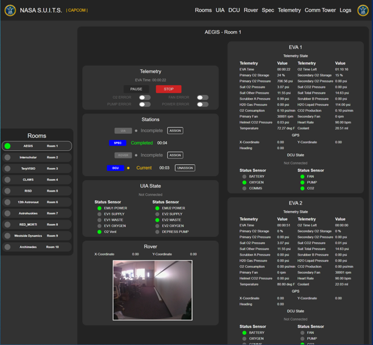

<h1 align="center">
  :man_astronaut: S.U.I.T.S. Telemetry Stream Server C :woman_astronaut:
<br>
| CAPCOM |
</h1>
<h4 align="center">
  :telescope: CAPCOM Web Interface for the S.U.I.T.S. Telemetry Stream Server C :rocket:
</h4>

---

<h5 align="center">
  <a href="https://microgravityuniversity.jsc.nasa.gov/nasasuits">NASA SUITS Website</a> •
  <a href="#earth_americas-for-suits-teams">For SUITS Teams</a> •
  <a href="#computer-for-nasa-team">For NASA Team</a>
</h5>

---
<br>

## :earth_americas: Run TSS Server
1. Clone the repository...
```
git clone https://github.com/SUITS-Techteam/TSS-2025.git
```
2. Navigate into the root of the repository
7. To build the TSS Server, run...\
On Linux or WSL, this will require the C compiler gcc.
```
./build.bat
```
You can also use the [Visual Studio build tools](https://learn.microsoft.com/en-us/cpp/build/walkthrough-compile-a-c-program-on-the-command-line?view=msvc-170) to compile with
```
./buildvs.bat
```


4. To run the TSS Server, run ...
```
./server.exe
```
You should see the following lines appear...
```
Hello World

Launching Server at IP: 192.168.51.109:14141
Configuring Local Address...
Creating Socket...
Binding Socket...
Listening...
```
To run the server on local host (which might be useful if using WSL) run the following command
```
./server.exe --local
```
You should see the following lines appear...
```
Hello World

Launching Server at IP: 127.0.0.1:14141
Configuring Local Address...
Creating Socket...
Binding Socket...
Listening...
```

5. Type the IP address printed by the server into a web browser (Replace with your IP)\
Make sure you are on the same network as the server when connecting to it.
```
http://192.168.51.109:14141
```
6. From this website, you can interact with the TSS.\
This is where you can monitor the state of the server, verify the display of your system, and virtually interact with the EVA devices like you will be doing in May.




## TSS EVA Devices
### UIA
| Sensor       | Value True | Value False | Description                        |
| ------------ | ---------- | ----------- | ---------------------------------- |
| EMU1 POWER   | ON         | OFF         | Remotely powers the suit for EVA 1 |
| EV1 SUPPLY   | OPEN       | CLOSED      | Fills EVA 1's liquid coolant       |
| EV1 WASTE    | OPEN       | CLOSED      | Flushes EVA 1's liquid coolant     |
| EV1 OXYGEN   | OPEN       | CLOSED      | Fills EVA 1's oxygen tanks         |
| EMU2 POWER   | ON         | OFF         | Remotely powers the suit for EVA 2 |
| EV2 SUPPLY   | OPEN       | CLOSED      | Fills EVA 1's liquid coolant       |
| EV2 WASTE    | OPEN       | CLOSED      | Flushes EVA 1's liquid coolant     |
| EV2 OXYGEN   | OPEN       | CLOSED      | Fills EVA 1's oxygen tanks         |
| O2 Vent      | OPEN       | CLOSED      | Flushes both EVAs oxygen tanks     |
| DEPRESS PUMP | ON         | OFF         | Pressurizes both EVA suits         |

### DCU
| Sensor  | Value True | Value False     | Description                                                                                           |
| ------- | ---------- | --------------- | ----------------------------------------------------------------------------------------------------- |
| BATTERY | SUIT BATT  | UMBILICAL POWER | Describes if the suit is running off its local battery or UIA power                                   |
| OXYGEN  | PRI TANK   | SEC TANK        | Describes if the suit is pulling from primary or secondary oxygen tanks                               |
| COMMS   | Channel A  | Channel B       | Describes if the suit is connected to Channel A or Channel B on comms                                 |
| FAN     | PRI FAN    | SEC FAN         | Describes if the suit is using the primary fan or secondary fan                                       |
| PUMP    | OPEN       | CLOSED          | Describes if the coolant pump for the suit is open or closed (allows water to be flushed or supplied) |
| CO2     | Scrubber A | Scrubber B      | Describes which scrubber is currently filling with CO2 (other is venting)                             |

### COMM TOWER
| Sensor  | Value True | Value False | Description                                   |
| ------- | ---------- | ----------- | --------------------------------------------- |
| COMM    | ON         | OFF         | Describes if the comm tower is powered or not |

### IMU
| Value   | Description               |
| ------- | ------------------------- |
| POSX    | Eastward UTM Coordinates  |
| POSY    | Northward UTM Coordinates |
| HEADING | Direction Facing          |

If you would like to test your code with simulated position values, there is a script you can
run by typing

```
python simulate_position.py <your_ip_address>
```

Where your ip address is the ip address of the machine that is running TSS

### ROVER
| Value   | Description               |
| ------- | ------------------------- |
| POSX    | LTV Current X Coordinate  |
| POSY    | LTV Current Y Coordinate  |
| POI_1_X | LTV POI 1 X Coordinates   |
| POI_1_Y | LTV POI 1 Y Coordinates   |
| POI_2_X | LTV POI 2 X Coordinates   |
| POI_2_Y | LTV POI 2 Y Coordinates   |
| POI_3_X | LTV POI 3 X Coordinates   |
| POI_3_Y | LTV POI 3 Y Coordinates   |
| PING    | LTV PING                  |

### SPEC
| Value   | Description                             |
| ------- | --------------------------------------- |
| NAME    | Name of the rock sample                 |
| ID      | ID of the rock sample                   |
| DATA    | Chemical composition of the rock sample |


-----

## TSS Files

* Server.c: contains the main function with a loop that processes HTTP messages and simulates data in the backend.
* Network.c: contains helper functions for the server to communicate with other devices.
* Server_data.c: contains the data that the server maintains and how that data is updated.
* public folder: contains a frontend for testing your device with TSS, along with all the json files that you will need from the server.

This server is based on "Network Programming in C" and builds off of the HTTPs example.

## UDP Socket communication

Commincation with the TSS is done via a UDP socket. To request data, send a message in the following format, all in big endian:

| Timestamp (unit32) | Command number (uint32) | 
| ------------------ | ----------------------- | 
| 4 bytes            | 4 bytes                 |

The timestamp is a UNIX timestamp, and the command numbers will be covered below. The socket will respond with a message of the following format:

| Timestamp (unit32) | Command number (uint32) | Output Data (variable)  |
| ------------------ | ----------------------- | ------------ |
| 4 bytes            | 4 bytes                 | 4 bytes      |

The command number will be the same one you sent, and the output data will either be an int32 or a float depending on the requested data. 

Note the one exception to the above output is the PR's LIDAR data, which will instead return 13 floats for it's output data. This will be explained further below. 

Here's a list of get commands you can send to the socket. They are mostly related to the json files in `public/json_data`, and will be listed as such. The command number order will match the order of data in the json file. 
| Command number | Command                       | Referenced .json file|
| -------------- | -------                       | --------- 
| 2-7            | Get EVA1 DCU switch states    | `DCU.json` |
| 8-13           | Get EVA2 DCU switch states    | `DCU.json` |
| 14-16          | Get ERROR states             | `ERROR.json` |
| 17-19          | Get EVA1 IMU states             | `IMU.json` |
| 20-22         | Get EVA2 IMU states             | `IMU.json` |
| 23-30         | Get ROVER states             | `ROVER.json` |
| 31-41         | Get EVA 1 SPEC states (excludes `name` field)            | `SPEC.json` |
| 42-52        | Get EVA 2 SPEC states (excludes `name` field)              | `SPEC.json` |
| 53-62        | Get UIA states             | `UIA.json` |
| 63        | Get current EVA time for the team number passed in the data field as a float            | `/teams/x/TELEMTRY.json` |
| 64-85        | Get TELEMETRY states for EVA1 and the team number passed in the data field as a float            | `/teams/x/TELEMTRY.json` |
| 86-107        | Get TELEMETRY states for EVA1 and the team number passed in the data field as a float            | `/teams/x/TELEMTRY.json` |
| 108-123        | Get EVA states for the team number passed in the data field as a float            | `/teams/x/EVA.json` |
| 124-171        | Get Pressurized Rover states for the team currently running the PR sim | `/teams/x/ROVER_TELEMETRY.json` |
| 172        | Get Pressurized Rover LIDAR data, explaned below | `/teams/x/ROVER_TELEMETRY.json` |

## Pressurized Rover LIDAR
The pressurized rover in the DUST simulation has 13 'LIDAR' sensors. Each of these sensors are points that shoot out a ray 10 meters in a direction.The value of each sensor will be the distance in centimeters the ray took to hit something, or -1 if it didn't hit anything. The return data of the 172 command above will actually be a list of 13 float values instead of the normal 1 float. Here is a description of each sensor in order:

| Sensor index | Unreal Sensor Coordinates                |  Sensor location description | Sensor Orientation |
| ------------ | ---------------------------------------- | ---------------------------- | ------------------ |
| 0            | (X=170.000000,Y=-150.000000,Z=15.000000) | Hub of the front left wheel | Yawed 30 degrees left (CCW) of vehicle forward | 
| 1            | (X=200.000000,Y=-40.000000,Z=20.000000) | Front left of vehicle frame | Yawed 20 degrees left (CCW) of vehicle forward | 
| 2            | (X=200.000000,Y=0.000000,Z=20.000000) | Front center of vehicle frame | Vehicle forward | 
| 3            | (X=200.000000,Y=40.00000,Z=20.000000) | Front right of vehicle frame | Yawed 20 degrees right (CW) of vehicle forward | 
| 4            | (X=170.000000,Y=150.000000,Z=15.000000) | Hub of front right wheel | Yawed 30 degrees right (CW) of vehicle forward | 
| 5            | (X=200.000000,Y=-40.000000,Z=20.000000) | Front left of vehicle frame | Pitched 25 degrees down of vehicle forward | 
| 6            | (X=200.000000,Y=40.000000,Z=20.000000) | Front right of vehicle frame | Pitched 25 degrees down of vehicle forward | 
| 7            | (X=0.000000,Y=-100.000000,Z=-0.000000) | Center Left of vehicle frame | Pitched 20 degrees down of vehicle left | 
| 8            | (X=0.000000,Y=100.000000,Z=-0.000000) | Center Right of vehicle frame | Pitched 20 degrees down of vehicle right | 
| 9            | (X=-135.000000,Y=-160.000000,Z=15.000000) | Hub of back left wheel | Yawed 40 degrees left (CW) of vehicle backwards | 
| 10           | (X=-180.000000,Y=-60.000000,Z=15.000000) | Rear left of vehicle frame | Vehicle backwards | 
| 11           | (X=-180.000000,Y=60.000000,Z=15.000000) | Rear right of vehicle frame | Vehicle backwards | 
| 12           | (X=-135.000000,Y=160.000000,Z=15.000000) | Hub of back right wheel | Yawed 40 degrees right (CCW) of vehicle backwards | 
## Pressurized Rover Commanding

Commanding the PR is done through the same socket connection, using the following command format:

| Timestamp (unit32) | Command number (uint32) | Input Data (float)  |
| ------------------ | ----------------------- | ------------ |
| 4 bytes            | 4 bytes                 | 4 bytes      |

The timestamp is a UNIX timestamp, and all data is in big endian. Here are the command numbers you will use for commanding the rover:

| Command number | Command     | Data input     |
| -------------- | -------     | ---------      |
| 1107           | Brakes      | float: 0 or 1    |
| 1109           | Throttle    | float: -100, 100 |
| 1110           | Steering    | float: -1.0, 1.0 |
| 1106           | Lights      | float:  0 or 1   |
